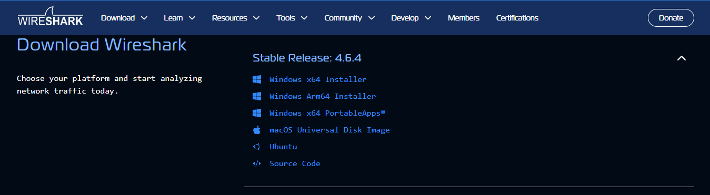
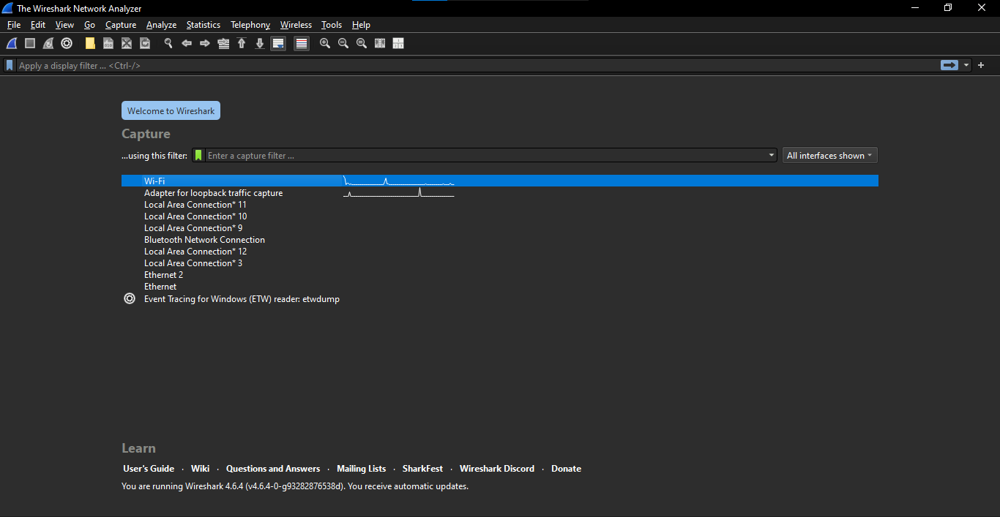
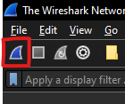
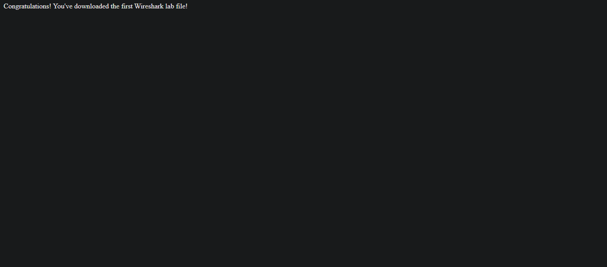
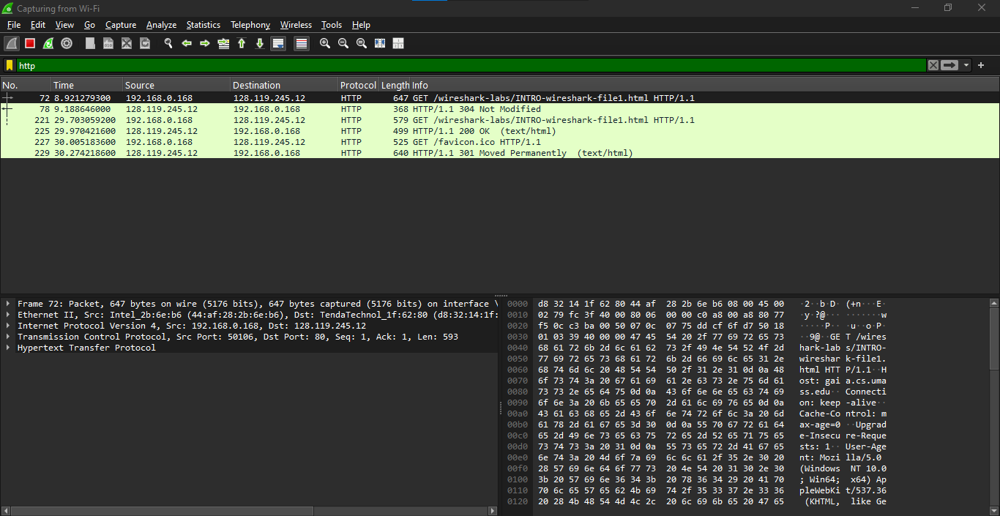
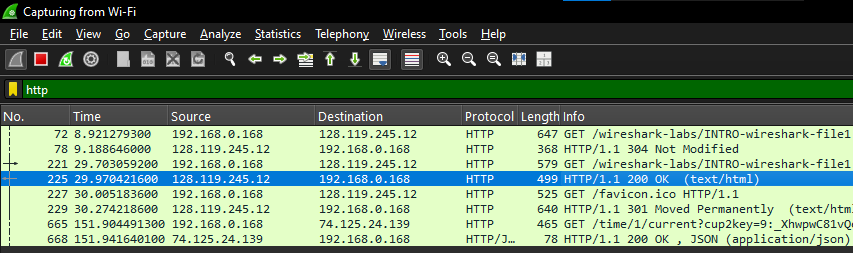
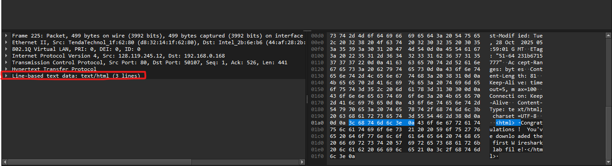
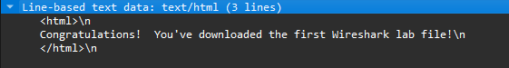

# Laporan Praktikum Jaringan Komputer Modul 1 & 2
### Running Modul dan Pengenalan Tools

Nama    : Ighfir Maulana  
NIM     : 103072400029  
Kelas   : IF-04-04

---

## 📋 Daftar Isi
- [Prasyarat](#-prasyarat)
- [Langkah Instalasi (Modul 1)](#-langkah-instalasi-modul-1)
- [Pengenalan Tools Analisis HTTP (Modul 2)](#-pengenalan-tools-analisis-http-modul-2)
- [Kontribusi](#-kontribusi)

---

## ⚙️ Prasyarat
Sebelum memulai praktikum, pastikan *device*mu sudah terinstal beberapa *software* berikut:

1.  **Wireshark**: Alat analisis protokol jaringan (Packet Sniffer).
2.  **Npcap / WinPcap**: Driver yang dibutuhkan agar Wireshark dapat menangkap paket secara real-time.

---

## 🛠️ Langkah Instalasi (Modul 1)
* Download installer melalui situs resmi [wireshark.org](https://www.wireshark.org/).
* Lakukan proses instalasi dan pastikan opsi **Install Npcap** sudah tercentang.

---

## 🚀 Pengenalan Tools Analisis HTTP (Modul 2)

Di sini kita akan belajar merekam/menangkap lalu lintas data dari Wi-Fi kita. Langkah-langkahnya sebagai berikut.
1.  Buka Wireshark dan klik 2 kali pada teks `Wi-Fi`.
2.  Otomatis akan merekam/menangkap lalu lintas data yang ada. Kalau tidak otomatis, klik tombol `Start` (ikon sirip hiu biru).
3.  Buka browser dan akses halaman: `http://gaia.cs.umass.edu/wireshark-labs/INTRO-wireshark-file1.html`.
> **Catatan:** Pastikan `http`, bukan `https`. Karena di beberapa *device* atau *browser* berubah secara otomatis.
4.  Kembali ke Wireshark dan ketik di kotak filter `http`.
5.  Cari dan klik pada data yang memiliki info `HTTP/1.1 200 OK (text/html)`.
> **Tips:** Kalau tidak muncul, coba gunakan *browser* lain atau me-*refresh*-nya secara berkala (cara *hard refresh*: `ctrl+shift+r`)
6.  Cari dan klik di kotak kiri bawah yang bertuliskan `Line-based text data: text/html (3 lines)`.
7. Kamu akan melihat teks html yang ada pada website tersebut.
8. Selamat, kita sudah menangkap lalu lintas data dari Wi-Fi kita.

> _**Disclaimer:** Laporan ini dibuat oleh saya sendiri berdasarkan modul yang ada dan dibantu AI untuk mempercantik tampilannya._

---

## 🤝 Kontribusi
Laporan ini disusun sebagai bagian dari tugas praktikum S-1 Informatika Telkom University. Kalau kamu ingin memberikan saran atau perbaikan pada dokumentasi ini, silakan ikuti langkah berikut:
1.  Lakukan **Fork** pada repositori ini.
2.  Buat branch baru untuk fitur atau perbaikan kamu.
3.  Kirimkan **Pull Request** dengan penjelasan mengenai perubahan yang dilakukan.

---
**Informatics Lab - Telkom University** *Semester Genap 2025/2026*
