# Laporan Praktikum Jaringan Komputer Modul 3
### Analisis Protokol HTTP

Nama    : Ighfir Maulana  
NIM     : 103072400029  
Kelas   : IF-04-04

---

## 📋 Daftar Isi
- [Prasyarat & Instalasi](#-prasyarat--instalasi)
- [Cara Penggunaan](#-cara-penggunaan)
  - [1. Basic HTTP GET/Response](#1-basic-http-getresponse)
  - [2. HTTP Conditional GET](#2-http-conditional-get)
  - [3. Retrieving Long Documents](#3-retrieving-long-documents)
  - [4. HTML Documents dengan Embedded Objects](#4-html-documents-dengan-embedded-objects)
  - [5. HTTP Authentication](#5-http-authentication)
- [Kontribusi](#-kontribusi)

## ⚙️ Prasyarat & Instalasi
* **Aplikasi**: Wireshark (Packet Sniffer).
* **Browser**: Disarankan menggunakan browser dengan fitur pembersihan cache yang mudah (Chrome/Firefox).
* **Koneksi Jaringan**: Diperlukan untuk melakukan pengambilan paket secara live dari server eksternal.

## 🚀 Cara Penggunaan

### 1. Basic HTTP GET/Response
* Mulai *capture* di Wireshark (untuk langkah detailnya, silakan lihat [modul 1 & 2 ](../Modul-01-02/laprak-01-02.md)).
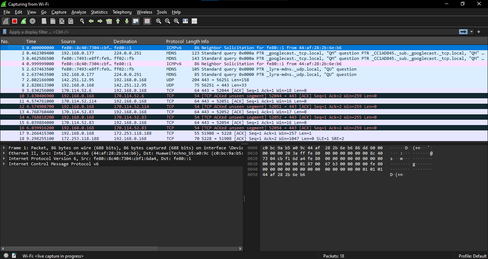
* Paste URL berikut ke browsermu: `http://gaia.cs.umass.edu/wireshark-labs/INTRO-wireshark-file1.html`.
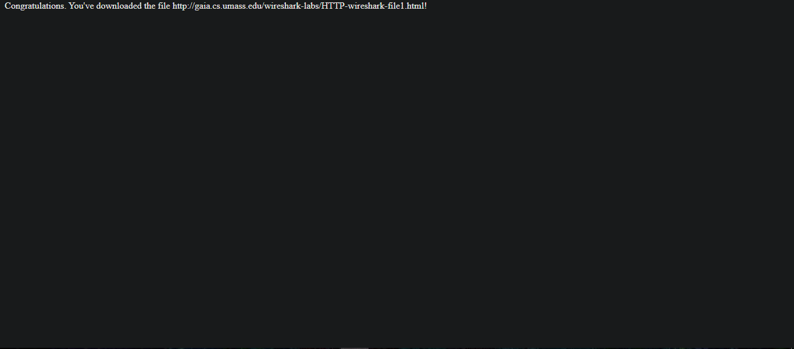
* Perhatikan pesan **GET** dan respons **200 OK** untuk melihat informasi lebih detail.
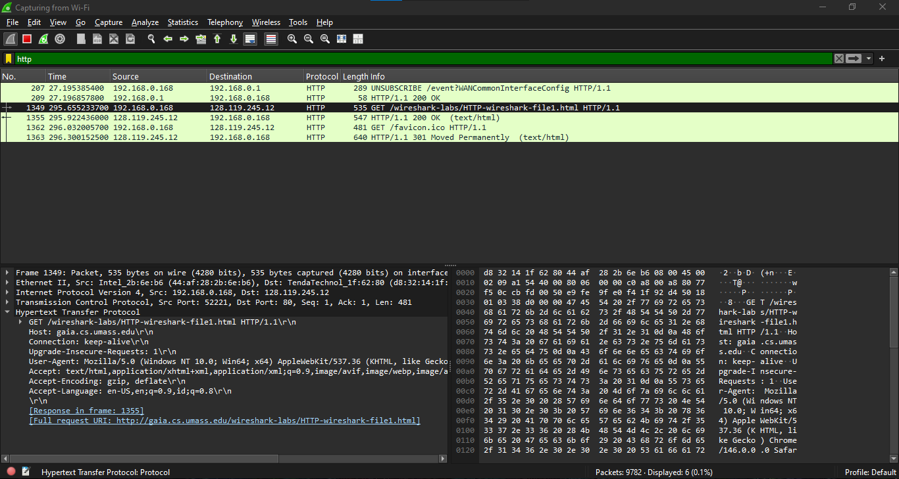
* Perhatikan panah ke kanan dan ke kiri di bagian samping kiri panel. Panah ke arah menandakan kita sedang meminta/*request* ke server (GET). Sedangkan panah ke kiri menandakan server memberikan informasi yang telah kita minta (200 OK).

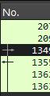

### 2. HTTP Conditional GET
* Mulai *capture* di Wireshark (untuk langkah detailnya, silakan lihat [modul 1 & 2 ](../Modul-01-02/laprak-01-02.md)).
* Paste URL berikut ke browsermu: `http://gaia.cs.umass.edu/wireshark-labs/HTTP-wireshark-file2.html`.
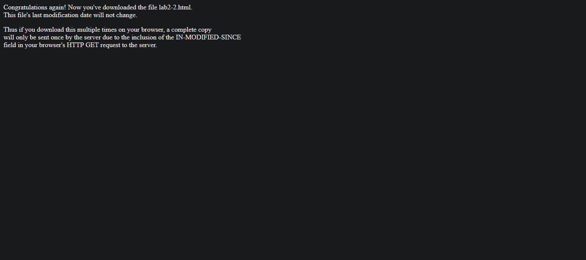
* Lakukan *hard refresh* pada halaman tersebut (cara *hard refresh* bisa dilihat di [modul 1 & 2 ](../Modul-01-02/laprak-01-02.md)).
* Lakukan *refresh* pada halaman tersebut.
* Ketik di kolom filter `http` (untuk langkah detailnya, silakan lihat [modul 1 & 2 ](../Modul-01-02/laprak-01-02.md)).
* Amati pesan `GET` yang mengandung header `If-Modified-Since` dan respons server `304 Not Modified` yang menandakan penggunaan cache.

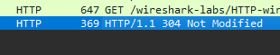

### 3. Retrieving Long Documents
* Mulai *capture* di Wireshark (untuk langkah detailnya, silakan lihat [modul 1 & 2 ](../Modul-01-02/laprak-01-02.md)).
* Akses URL dengan dokumen yang panjang (misal: file teks *Bill of Rights*): `http://gaia.cs.umass.edu/wireshark-labs/HTTP-wireshark-file3.html`.
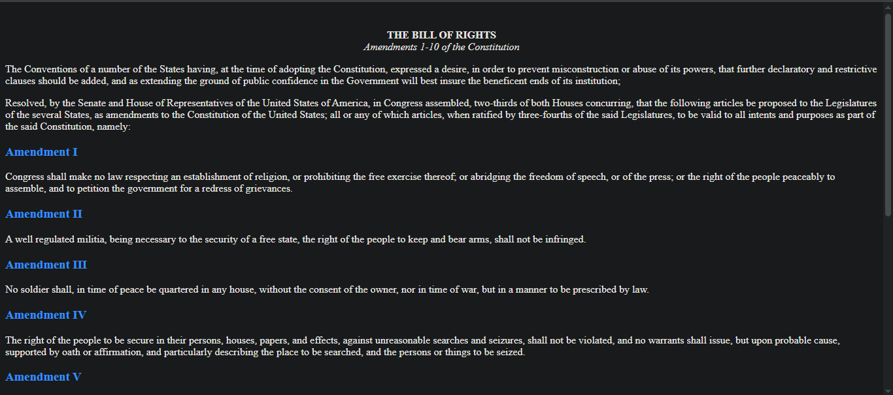
* Ketik di kolom filter `http` (untuk langkah detailnya, silakan lihat [modul 1 & 2 ](../Modul-01-02/laprak-01-02.md))
* Klik `HTTP/1.1 200 OK` pada panel *capture* Wireshark.

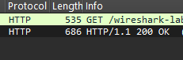
* Perhatikan teks `Transmission Control Protocol` di bagian bawah Wireshark.

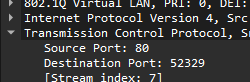
* Klik teks tersebut agar bisa melihat informasi lebih detail.
* Scroll ke bawah, cari, dan klik teks `4 Reassembled TCP Segments`.
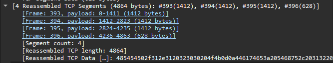
* Amati bagaimana respons HTTP tunggal dipecah menjadi beberapa segmen TCP karena ukuran file yang besar (fragmentasi).

### 4. HTML Documents dengan Embedded Objects
* Mulai *capture* di Wireshark (untuk langkah detailnya, silakan lihat [modul 1 & 2 ](../Modul-01-02/laprak-01-02.md)).
* Paste URL berikut ke browsermu: `http://gaia.cs.umass.edu/wireshark-labs/HTTP-wireshark-file4.html`.
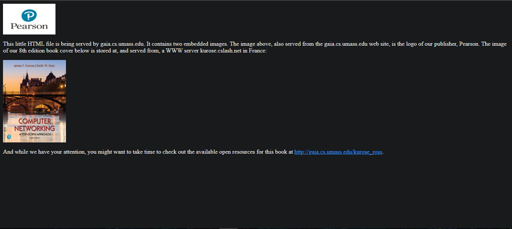
* Ketik di kolom filter `http` (untuk langkah detailnya, silakan lihat [modul 1 & 2 ](../Modul-01-02/laprak-01-02.md))
* Perhatikan `GET` selain yang meminta URL web tersebut. Terdapat beberapa `GET` lain yang menandakan ada objek lain (dalam *case* ini png dan jpg) yang kita minta dan ternyata tidak disimpan dalam html itu sendiri melainkan URL yang menuju objek-objek yang tersebut yang disematkan pada web yang kita tuju.

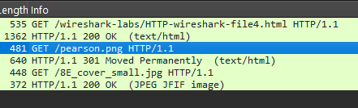

### 5. HTTP Authentication
* Mulai *capture* di Wireshark (untuk langkah detailnya, silakan lihat [modul 1 & 2 ](../Modul-01-02/laprak-01-02.md)).
* Akses halaman yang dilindungi: `http://gaia.cs.umass.edu/wireshark-labs/protected_pages/HTTP-wireshark-file5.html`.
* Masukkan *username*: `wireshark-students` dan *password*: `network` (usahakan ketik manual).
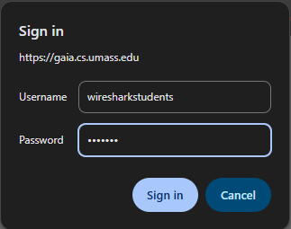
* Jika *username* dan *password* benar, maka akan tampil website yang kita tuju.
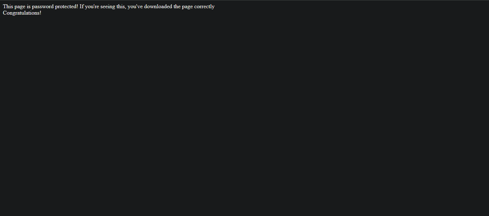
* Ketik di kolom filter `http` (untuk langkah detailnya, silakan lihat [modul 1 & 2 ](../Modul-01-02/laprak-01-02.md))
* Perhatikan teks pada panel *record* di Wireshark. Teksnya akan jauh berbeda dari URL-URL yang sebelumnya telah kita akses. Lebih panjang dan lebih kompleks. Menandakan bahwa ada step tambahan berupa memasukkan *username* dan *password* untuk mengakses URL tersebut.

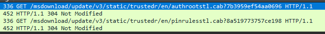

## 🤝 Kontribusi
Laporan ini disusun sebagai bagian dari tugas praktikum S-1 Informatika Telkom University. Kalau kamu ingin memberikan saran atau perbaikan pada dokumentasi ini, silakan ikuti langkah berikut:
1.  Lakukan **Fork** pada repositori ini.
2.  Buat branch baru untuk fitur atau perbaikan kamu.
3.  Kirimkan **Pull Request** dengan penjelasan mengenai perubahan yang dilakukan.

---
**Informatics Lab - Telkom University** *Semester Genap 2025/2026*
