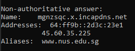
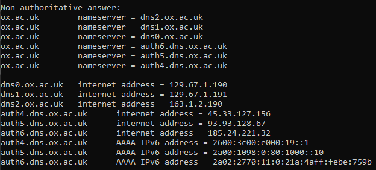
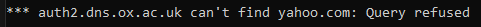
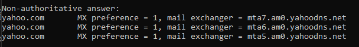
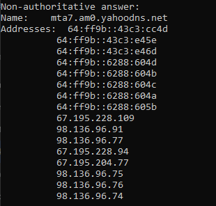

# Modul 4: DNS (*Domain Name System*)
### Investigasi Cara Kerja DNS menggunakan Wireshark

Nama    : Ighfir Maulana  
NIM     : 103072400029  
Kelas   : IF-04-04

---

## 📋 Daftar Isi
- [Prasyarat & Instalasi](#-prasyarat--instalasi)
- [Langkah-Langkah Eksperimen](#-langkah-langkah-eksperimen)
- [Hasil & Jawaban Pertanyaan](#-hasil--jawaban-pertanyaan)
- [Fitur Utama](#-fitur-utama)

## ⚙️ Prasyarat & Instalasi
* **Sistem Operasi**: Windows (menggunakan `nslookup` dan `ipconfig`).
* **Aplikasi**: Wireshark (untuk menangkap trafik UDP).
* **Terminal**: Command Prompt (CMD) atau PowerShell.

## 🚀 Langkah-Langkah Eksperimen

### 1. Menggunakan Nslookup
* Menjalankan perintah `nslookup` sederhana untuk mencari alamat IP dari domain tertentu.
* Menggunakan opsi `-type=NS` untuk mencari server DNS otoritatif.

### 2. Konfigurasi Lokal dengan Ipconfig
* Menjalankan `ipconfig /all` untuk melihat alamat IP server DNS lokal yang digunakan oleh perangkat.
* Melakukan `ipconfig /flushdns` untuk membersihkan cache DNS agar kueri baru terekam oleh Wireshark.

### 3. Tracing DNS dengan Wireshark
* Memulai capture di Wireshark.
* Menjalankan kueri DNS di terminal.
* Menggunakan filter `dns` di Wireshark untuk mengisolasi paket kueri (Query) dan balasan (Response).

---

## 📝 Hasil & Jawaban Pertanyaan

Berikut adalah jawaban untuk pertanyaan-pertanyaan yang terdapat dalam modul praktikum:

### Bundle 1 (Nslookup)
1. **Jalankan nslookup untuk mendapatkan alamat IP dari server web di Asia. Berapa alamat IP server tersebut?**

  * **Hasil:** IP server dari National University of Singapore adalah 45.60.35.225.
  * **Query:** `nslookup www.nus.edu.sg`

2. **Jalankan nslookup agar dapat mengetahui server DNS otoritatif untuk universitas di Eropa.**

   * **Hasil:** Server DNS otoritatif dari Oxford University adalah sebagai berikut.

   * **Query:** `nslookup -type=NS ox.ac.uk`

3. **Jalankan nslookup untuk mencari tahu informasi mengenai server email dari Yahoo! Mail melalui salah satu server yang didapatkan di pertanyaan nomor 2. Apa alamat IP-nya?**
   * **Hasil 1:** Karena saya telah mencoba pada alamat website Oxford University dan ternyata terjadi `Timeout`, maka saya mencobanya pada `yahoo.com` agar lebih mudah.
   * **Query:** `nslookup -type=MX yahoo.com dns2.ox.ac.uk`

   > fyi: `Refused` atau `Timeout` terjadi karena server mematikan fitur rekursif demi keamanan
   
   * **Hasil 2:** Untuk percobaan pada `yahoo.com` akan menampilkan daftar mail exchanger (MX) seperti `mta7.am0.yahoodns.net` seperti ini.

   * **Query:** `nslookup -type=MX yahoo.com`

   * **Hasil 3:** Untuk hasil pencarian alamat IP Server Email `mta7.am0.yahoodns.net` akan terlihat seperti ini.

   * **Query:** `nslookup mta5.am0.yahoodns.net`

### Bundle 2 (http://www.ietf.org)
1. **Cari pesan permintaan DNS dan balasannya. Apakah pesan tersebut dikirimkan melalui UDP atau TCP?**
  * **Jawaban:** Pesan dikirim ke alamat IP Server DNS lokal (biasanya alamat Gateway atau IP DNS Google 8.8.8.8 tergantung pengaturan). Alamat ini dapat divalidasi dengan hasil `ipconfig /all`.

2. **Apa port tujuan pada pesan permintaan DNS? Apa port sumber pada pesan balasannya?**
  * **Jawaban:**

3. **Pada pesan permintaan DNS, apa alamat IP tujuannya? Apa alamat IP server DNS lokal anda (gunakan ipconfig untuk mencari tahu)? Apakah kedua alamat IP tersebut sama?**
  * **Jawaban:**

4. **Periksa pesan permintaan DNS. Apa “jenis” atau ”type” dari pesan tersebut? Apakah pesan permintaan tersebut mengandung ”jawaban” atau ”answers”?**
  * **Jawaban:**

5. **Periksa pesan balasan DNS. Berapa banyak ”jawaban” atau ”answers” yang terdapat di dalamnya? Apa saja isi yang terkandung dalam setiap jawaban tersebut?**
  * **Jawaban:**

6. **Perhatikan paket TCP SYN yang selanjutnya dikirimkan oleh host Anda. Apakah alamat IP pada paket tersebut sesuai dengan alamat IP yang tertera pada pesan balasan DNS?**
  * **Jawaban:**

7. **Halaman web yang sebelumnya anda akses (http://www.ietf.org) memuat beberapa gambar. Apakah host Anda perlu mengirimkan pesan permintaan DNS baru setiap kali ingin mengakses suatu gambar?**
  * **Jawaban:**

1. **Ke alamat IP manakah pesan permintaan DNS dikirimkan? Apakah itu server DNS lokal Anda?**
   * **Jawaban:** Pesan dikirim ke alamat IP Server DNS lokal (biasanya alamat Gateway atau IP DNS Google 8.8.8.8 tergantung pengaturan). Alamat ini dapat divalidasi dengan hasil `ipconfig /all`.

2. **Periksa pesan permintaan (Query) DNS. Apa "type" pesan tersebut? Apakah mengandung "answers"?**
   * **Jawaban:** Tipe pesan kueri biasanya adalah **Type A** (Standard Query). Pesan kueri **tidak mengandung jawaban** (0 Answers); ia hanya berisi bagian "Questions".

3. **Periksa pesan balasan (Response) DNS. Berapa banyak "answers" yang diberikan? Apa isinya?**
   * **Jawaban:** Jumlah jawaban bervariasi tergantung domain. Isinya berupa record tipe A yang memetakan nama host ke alamat IP tujuan (misal: `www.aiit.or.kr` -> `210.102.100.222`).

4. **Analisis Header UDP (Berdasarkan Modul): Apa saja field yang terdapat pada header UDP?**
   * **Jawaban:** Header UDP terdiri dari 4 field utama:
     1. Source Port
     2. Destination Port
     3. Length
     4. Checksum

### Bundle 3 (http://gaia.cs.umass.edu/wireshark-labs/wireshark-traces.zip)
1. **Apa port tujuan pada pesan permintaan DNS? Apa port sumber pada pesan balasan DNS?**
  * **Jawaban:** 

2. **Ke alamat IP manakah pesan permintaan DNS dikirimkan? Apakah alamat IP tersebut merupakan default alamat IP server DNS lokal Anda?**
  * **Jawaban:** 

3. **Periksa pesan permintaan DNS. Apa ”jenis” atau ”type” dari pesan tersebut? Apakah pesan tersebut mengandung ”jawaban” atau ”answers”?**
  * **Jawaban:** 

4. **Periksa pesan balasan DNS. Berapa banyak ”jawaban” atau “answers” yang terdapat di dalamnya. Apa saja isi yang terkandung dalam setiap jawaban tersebut?**
  * **Jawaban:** 

5. **Sertakan hasil tangkapan layar.**
  * **Hasil** 

### Bundle 4 (nslookup –type=NS mit.edu)
1. **Ke alamat IP manakah pesan permintaan DNS dikirimkan? Apakah alamat IP tersebut merupakan default alamat IP server DNS lokal Anda?**
  * **Jawaban:** 

2. **Periksa pesan permintaan DNS. Apa ”jenis” atau ”type” dari pesan tersebut? Apakah pesan tersebut mengandung ”jawaban” atau ”answers”?**
  * **Jawaban:** 

3. **Periksa pesan balasan DNS. Berapa banyak ”jawaban” atau “answers” yang terdapat di dalamnya. Apa saja isi yang terkandung dalam setiap jawaban tersebut?**
  * **Jawaban:** 

4. **Sertakan hasil tangkapan layar.**
  * **Hasil** 

### Bundle 5 (nslookup www.aiit.or.kr bitsy.mit.edu)
1. **Ke alamat IP manakah pesan permintaan DNS dikirimkan? Apakah alamat IP tersebut merupakan default alamat IP server DNS lokal Anda?**
  * **Jawaban:** 

2. **Periksa pesan permintaan DNS. Apa ”jenis” atau ”type” dari pesan tersebut? Apakah pesan tersebut mengandung ”jawaban” atau ”answers”?**
  * **Jawaban:** 

3. **Periksa pesan balasan DNS. Berapa banyak ”jawaban” atau “answers” yang terdapat di dalamnya. Apa saja isi yang terkandung dalam setiap jawaban tersebut?**
  * **Jawaban:** 

4. **Sertakan hasil tangkapan layar.**
  * **Hasil** 

## 🤝 Kontribusi
Laporan ini disusun sebagai bagian dari tugas praktikum S-1 Informatika Telkom University. Kalau kamu ingin memberikan saran atau perbaikan pada dokumentasi ini, silakan ikuti langkah berikut:
1.  Lakukan **Fork** pada repositori ini.
2.  Buat branch baru untuk fitur atau perbaikan Anda.
3.  Kirimkan **Pull Request** dengan penjelasan mengenai perubahan yang dilakukan.

---
**Informatics Lab - Telkom University** *Semester Genap 2025/2026*