# Modul 4: DNS (*Domain Name System*)
### Investigasi Cara Kerja DNS menggunakan Wireshark

Nama    : Ighfir Maulana  
NIM     : 103072400029  
Kelas   : IF-04-04

---

## 📋 Daftar Isi
- [Prasyarat & Instalasi](#-prasyarat--instalasi)
- [Langkah-Langkah Eksperimen](#-langkah-langkah-eksperimen)
- [Hasil & Jawaban Pertanyaan](#-hasil--jawaban-pertanyaan)
- [Fitur Utama](#-fitur-utama)

## ⚙️ Prasyarat & Instalasi
* **Sistem Operasi**: Windows (menggunakan `nslookup` dan `ipconfig`).
* **Aplikasi**: Wireshark (untuk menangkap trafik UDP).
* **Terminal**: Command Prompt (CMD) atau PowerShell.

## 🚀 Langkah-Langkah Eksperimen

### 1. Menggunakan Nslookup
* Menjalankan perintah `nslookup` sederhana untuk mencari alamat IP dari domain tertentu.
* Menggunakan opsi `-type=NS` untuk mencari server DNS otoritatif.

### 2. Konfigurasi Lokal dengan Ipconfig
* Menjalankan `ipconfig /all` untuk melihat alamat IP server DNS lokal yang digunakan oleh perangkat.
* Melakukan `ipconfig /flushdns` untuk membersihkan cache DNS agar kueri baru terekam oleh Wireshark.

### 3. Tracing DNS dengan Wireshark
* Memulai capture di Wireshark.
* Menjalankan kueri DNS di terminal.
* Menggunakan filter `dns` di Wireshark untuk mengisolasi paket kueri (Query) dan balasan (Response).

---

## 📝 Hasil & Jawaban Pertanyaan

Berikut adalah jawaban untuk pertanyaan-pertanyaan yang terdapat dalam modul praktikum:

### Bundle 1 (Nslookup)
1. **Jalankan nslookup untuk mendapatkan alamat IP dari server web di Asia. Berapa alamat IP server tersebut?**

  * **Hasil:** IP server dari National University of Singapore adalah 45.60.35.225.
  * **Query:** `nslookup www.nus.edu.sg`

2. **Jalankan nslookup agar dapat mengetahui server DNS otoritatif untuk universitas di Eropa.**

   * **Hasil:** Server DNS otoritatif dari Oxford University adalah sebagai berikut.

   * **Query:** `nslookup -type=NS ox.ac.uk`

3. **Jalankan nslookup untuk mencari tahu informasi mengenai server email dari Yahoo! Mail melalui salah satu server yang didapatkan di pertanyaan nomor 2. Apa alamat IP-nya?**
   * **Hasil 1:** Karena saya telah mencoba pada alamat website Oxford University dan ternyata terjadi `Timeout`, maka saya mencobanya pada `yahoo.com` agar lebih mudah.
   * **Query:** `nslookup -type=MX yahoo.com dns2.ox.ac.uk`

   > fyi: `Refused` atau `Timeout` terjadi karena server mematikan fitur rekursif demi keamanan
   
   * **Hasil 2:** Untuk percobaan pada `yahoo.com` akan menampilkan daftar mail exchanger (MX) seperti `mta7.am0.yahoodns.net` seperti ini.

   * **Query:** `nslookup -type=MX yahoo.com`

   * **Hasil 3:** Untuk hasil pencarian alamat IP Server Email `mta7.am0.yahoodns.net` akan terlihat seperti ini.

   * **Query:** `nslookup mta7.am0.yahoodns.net`

### Bundle 2 (http://www.ietf.org)
Sebelum menjawab Bundle 2 ini, coba kalian buka `CMD (admin)` dan ketik `ipconfig /flushdns` agar memastikan komputer benar-benar bertanya ke server, bukan membaca catatan lama. Setelah itu, cari `IP` dengan mengetikkan `ipconfig` pada `CMD` (misal: **192.168.1.15**).

Lalu buka `Wireshark` dan pilih metode internet yang kita pakai (kalo aku pakai Wi-Fi). Di kolom filter, ketik `ip.addr == [IP KAMU]` (misal: **ip.addr == 192.168.1.15**). Lalu klik *Start*.

Buka browser (kalo aku pake mode *Incognito* biar bersih dari *cache*), lalu buka http://www.ietf.org. Terakhir, *stop capture*.

1. **Cari pesan permintaan DNS dan balasannya. Apakah pesan tersebut dikirimkan melalui UDP atau TCP?**
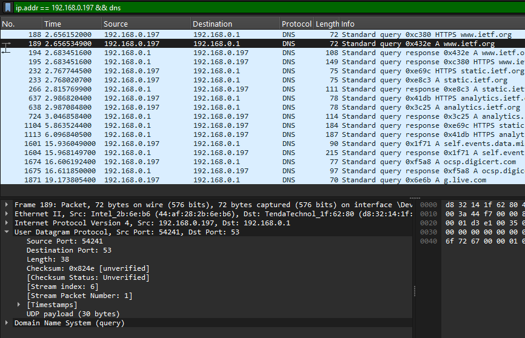
  * **Jawaban:** Berdasarkan hasil praktikum saya, pesan tersebut dikirimkan melalui UDP, terlihat seperti gambar di atas.

2. **Apa port tujuan pada pesan permintaan DNS? Apa port sumber pada pesan balasannya?**
  * **Jawaban:** Port tujuan pada pesan permintaan: 53 dan port sumber pada pesan balasannya: 53. Ya secara logika harusnya sama karena port itu adalah port yang meminta dan port yang akan dibalas.

3. **Pada pesan permintaan DNS, apa alamat IP tujuannya? Apa alamat IP server DNS lokal anda (gunakan ipconfig untuk mencari tahu)? Apakah kedua alamat IP tersebut sama?**
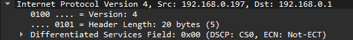
  * **Jawaban:** alamat IP-nya sama seperti IP saya (saya tidak ingin menyebutkannya secara jelas karena saya tidak tahu itu aman atau tidak).

4. **Periksa pesan permintaan DNS. Apa “jenis” atau ”type” dari pesan tersebut? Apakah pesan permintaan tersebut mengandung ”jawaban” atau ”answers”?**
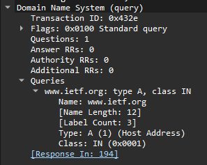
  * **Jawaban:** Pesan permintaan bertipe A dan tidak mengandung jawaban (`Answers RRs: 0`, seperti di gambar) karena bagian jawaban hanya diisi oleh server saat membalas.

5. **Periksa pesan balasan DNS. Berapa banyak ”jawaban” atau ”answers” yang terdapat di dalamnya? Apa saja isi yang terkandung dalam setiap jawaban tersebut?**
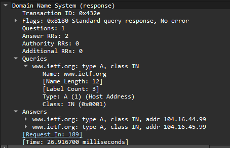
  * **Jawaban:** Ada 2 jawaban yang berisi nama domain, *tipe record* (A), *class*, nilai TTL (*Time to Live*), panjang data, dan alamat IP dari www.ietf.org.

6. **Perhatikan paket TCP SYN yang selanjutnya dikirimkan oleh host Anda. Apakah alamat IP pada paket tersebut sesuai dengan alamat IP yang tertera pada pesan balasan DNS?**
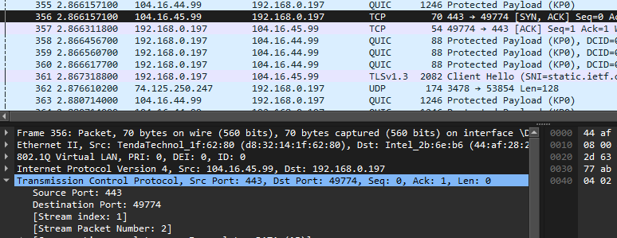
  * **Jawaban:** Seharusnya, alamat IP tujuan pada paket TCP SYN pasti sesuai dengan alamat IP di paket balasan sebelumnya. Tapi di sini, saya tidak bisa menemukan alamat IP yang seperti itu. Bisa jadi karena saya membuka beberapa tab ataupun karena *browser* menggunakan alamat IPv6 (AAAA record) sehingga saya tidak bisa menemukannya.

7. **Halaman web yang sebelumnya anda akses (http://www.ietf.org) memuat beberapa gambar. Apakah host Anda perlu mengirimkan pesan permintaan DNS baru setiap kali ingin mengakses suatu gambar?**
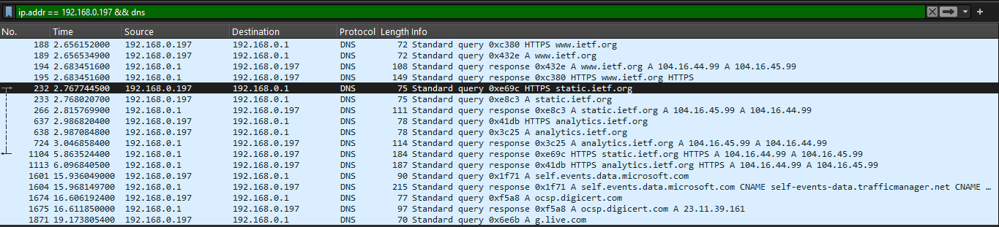
  * **Jawaban:** Tidak, terlihat seperti di bukti yang saya lampirkan, hanya butuh beberapa *query* untuk mengakses www.ietf.org secara penuh. Itu karean informasi-informasi akan disimpan di DNS Cache lokal untuk sementara waktu sehingga tidak perlu mengirimkan *query* baru setiap kali ingin mengakses suatu gambar.

### Bundle 3 (http://gaia.cs.umass.edu/wireshark-labs/wireshark-traces.zip)
1. **Apa port tujuan pada pesan permintaan DNS? Apa port sumber pada pesan balasan DNS?**
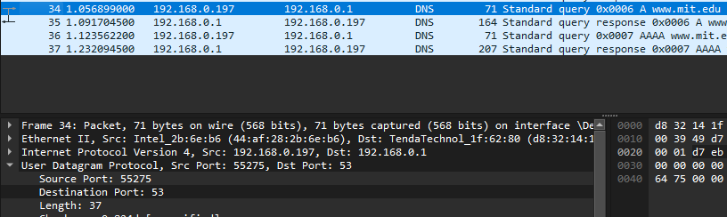
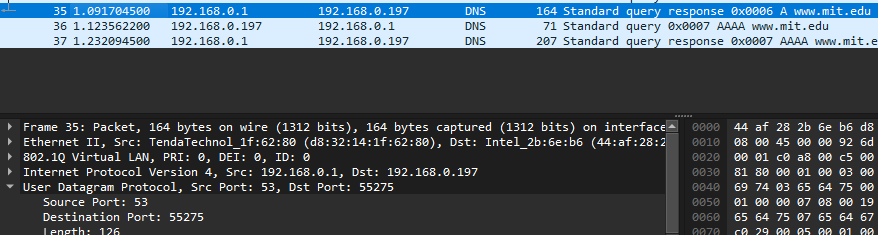
  * **Jawaban:** Port tujuan pada pesan permintaan: 53 dan port sumber pada pesan balasannya: 53.

2. **Ke alamat IP manakah pesan permintaan DNS dikirimkan? Apakah alamat IP tersebut merupakan default alamat IP server DNS lokal Anda?**

  * **Jawaban:** Pesan permintaan DNS dikirim ke alamat IP server DNS seperti di gambar. Ya, itu merupakan default alamat IP server DNS lokal saya.

3. **Periksa pesan permintaan DNS. Apa ”jenis” atau ”type” dari pesan tersebut? Apakah pesan tersebut mengandung ”jawaban” atau ”answers”?**
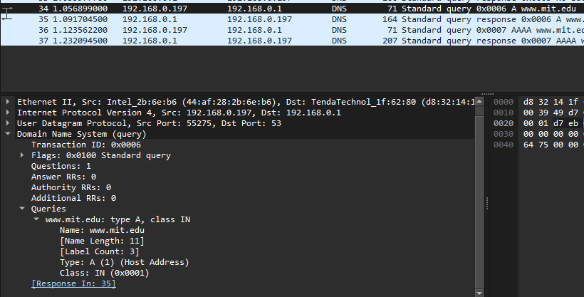
  * **Jawaban:** Pesan permintaan DNS bertipe Type A dan tidak mengandung jawaban seperti di gambar karena dia meminta yang otomatis tidak membawa jawaban.

4. **Periksa pesan balasan DNS. Berapa banyak ”jawaban” atau “answers” yang terdapat di dalamnya. Apa saja isi yang terkandung dalam setiap jawaban tersebut?**
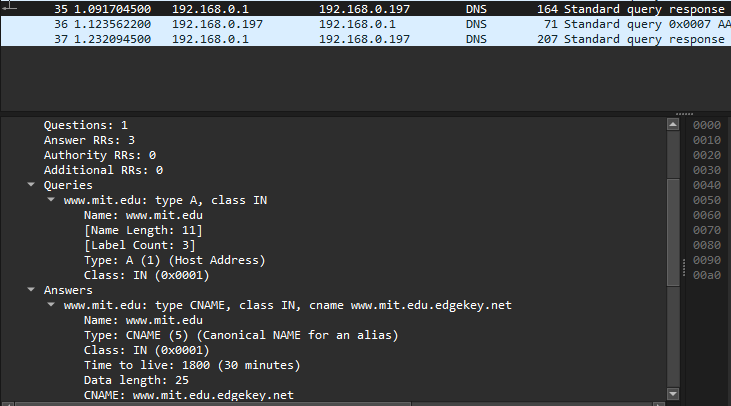
  * **Jawaban:** Ada 3 jawaban yang berisi nama domain, *tipe*, *class*, nilai TTL (*Time to Live*), panjang data, dan `CNAME`.

### Bundle 4 (nslookup –type=NS mit.edu)
1. **Ke alamat IP manakah pesan permintaan DNS dikirimkan? Apakah alamat IP tersebut merupakan default alamat IP server DNS lokal Anda?**
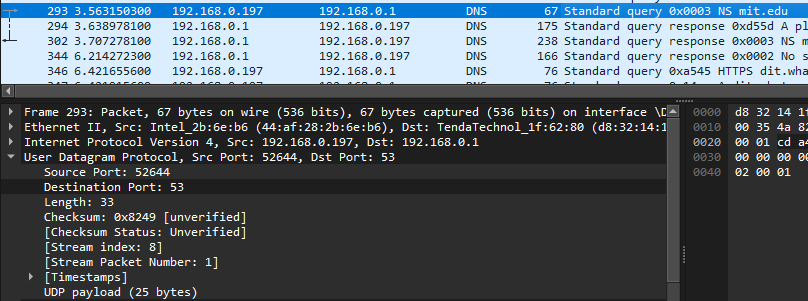
  * **Jawaban:** Pesan dikirim ke alamat IP Server DNS lokal, sama seperti soal soal sebelumnya (seperti di gambar).

2. **Periksa pesan permintaan DNS. Apa ”jenis” atau ”type” dari pesan tersebut? Apakah pesan tersebut mengandung ”jawaban” atau ”answers”?**
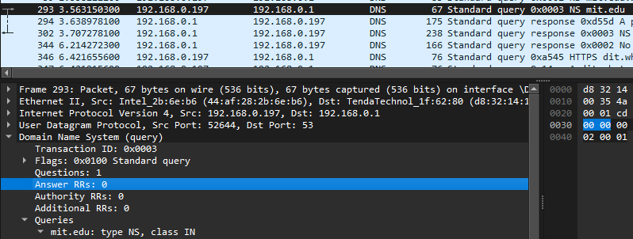
  * **Jawaban:** Pesan permintaan DNS bertipe Type A dan tidak mengandung jawaban seperti di gambar karena dia meminta yang otomatis tidak membawa jawaban.

3. **Periksa pesan balasan DNS. Berapa banyak ”jawaban” atau “answers” yang terdapat di dalamnya. Apa saja isi yang terkandung dalam setiap jawaban tersebut?**
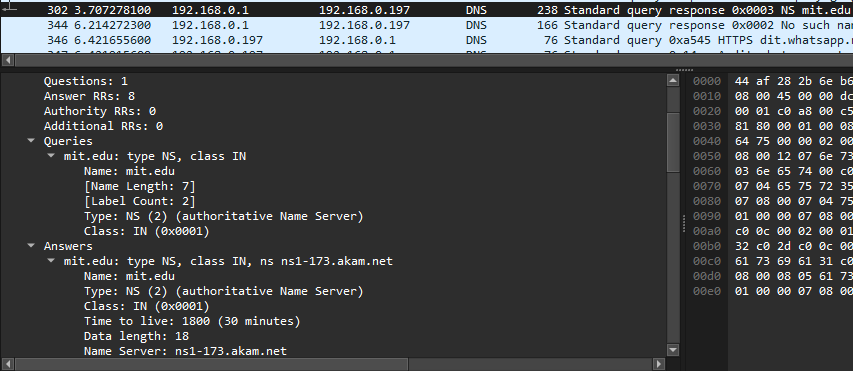
  * **Jawaban:** Ada 8 jawaban yang berisi nama domain, *tipe*, *class*, nilai TTL (*Time to Live*), panjang data, dan nama server.

### Bundle 5 (nslookup www.aiit.or.kr bitsy.mit.edu)
1. **Ke alamat IP manakah pesan permintaan DNS dikirimkan? Apakah alamat IP tersebut merupakan default alamat IP server DNS lokal Anda?**
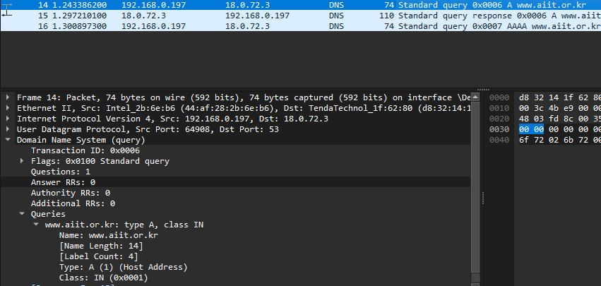
  * **Jawaban:** Pesan dikirim ke alamat IP Server DNS lokal, sama seperti soal soal sebelumnya (seperti di gambar).

2. **Periksa pesan permintaan DNS. Apa ”jenis” atau ”type” dari pesan tersebut? Apakah pesan tersebut mengandung ”jawaban” atau ”answers”?**
  * **Jawaban:** Pesan permintaan DNS bertipe Type A dan tidak mengandung jawaban seperti di gambar karena dia meminta yang otomatis tidak membawa jawaban.

3. **Periksa pesan balasan DNS. Berapa banyak ”jawaban” atau “answers” yang terdapat di dalamnya. Apa saja isi yang terkandung dalam setiap jawaban tersebut?**
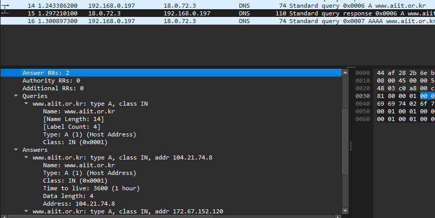
  * **Jawaban:** Ada 2 jawaban yang berisi nama domain, *tipe*, *class*, nilai TTL (*Time to Live*), panjang data, dan *Address*.

### Modul 5 (nslookup www.aiit.or.kr bitsy.mit.edu)

## 🤝 Kontribusi
Laporan ini disusun sebagai bagian dari tugas praktikum S-1 Informatika Telkom University. Kalau kamu ingin memberikan saran atau perbaikan pada dokumentasi ini, silakan ikuti langkah berikut:
1.  Lakukan **Fork** pada repositori ini.
2.  Buat branch baru untuk fitur atau perbaikan Anda.
3.  Kirimkan **Pull Request** dengan penjelasan mengenai perubahan yang dilakukan.

---
**Informatics Lab - Telkom University** *Semester Genap 2025/2026*