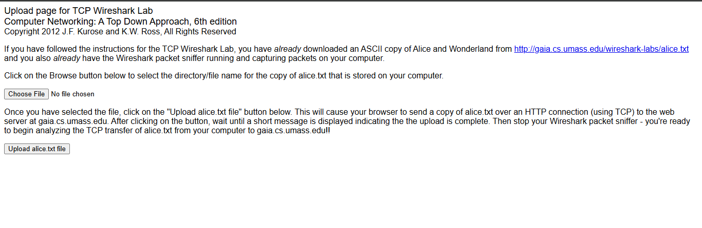
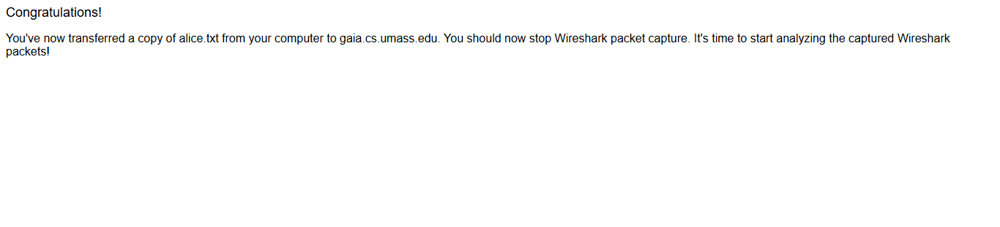
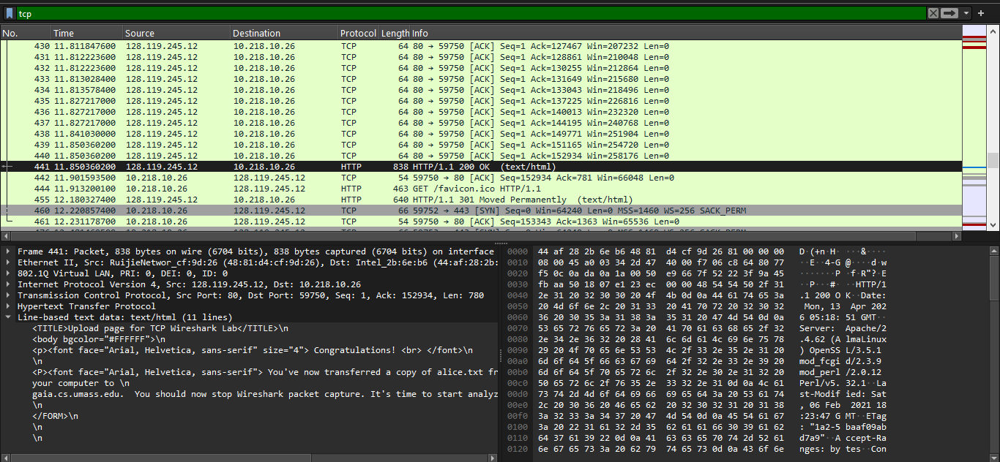
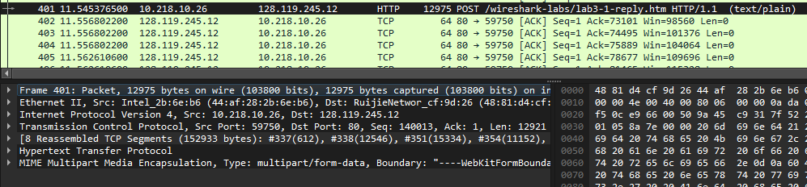
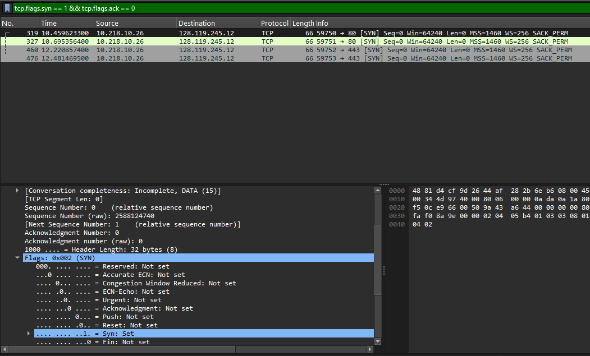

# Modul 6 TCP (Transmission Control Protocol)
### Investigasi Mekanisme *Handshake*, *Sequence Numbers*, dan *Congestion Control*

Nama    : Ighfir Maulana  
NIM     : 103072400029  
Kelas   : IF-04-04

---

## 📋 Daftar Isi
- [Prasyarat & Instalasi](#-prasyarat--instalasi)
- [Langkah Praktikum](#-langkah-praktikum)
- [Hasil & Analisis](#-hasil--analisis)
- [Fitur Utama](#-fitur-utama)
- [Kontribusi](#-kontribusi)

---

## ⚙️ Prasyarat & Instalasi
* **Aplikasi**: Wireshark (Packet Sniffer).
* **File Uji**: `alice.txt` (naskah teks ASCII Alice in Wonderland).
* **URL Target**: `http://gaia.cs.umass.edu/wireshark-labs/TCP-wireshark-file1.html`.
* **Koneksi Jaringan**: Diperlukan untuk proses unggah (upload) file ke server jarak jauh.

---

## 🚀 Langkah Praktikum

1. Kosongkan *cache browser* (sudah pernah dibahas pada modul sebelumnya)
2. Buka http://gaia.cs.umass.edu/wireshark-labs/alice.txt dan unduh salinan ASCII dari naskah `Alice in Wonderland`. Simpan file tersebut di komputer kamu.
3. Buka http://gaia.cs.umass.edu/wireshark-labs/TCP-wireshark-file1.html

4. Klik tombol *Browse* untuk memasukkan file `Alice in Wonderland`. **TAPI JANGAN UPLOAD DULU**
5. Buka Wireshark dan mulai *capture*.
6. Baru *upload file* `Alice in Wonderland`.

7. Ketik `tcp` di kolom filter Wireshark.

---

## 📝 Hasil & Analisis

### BUNDLE 1
### 1. Berapa alamat IP dan nomor port TCP yang digunakan oleh komputer klien (sumber) untuk mentransfer file ke gaia.cs.umass.edu?

* **Jawaban**: alamat IP-nya adalah `10.128.10.26` dan port-nya adalah `59750`. 

### 2. Apa alamat IP dari gaia.cs.umass.edu? Pada nomor port berapa ia mengirim dan menerima segmen TCP untuk koneksi ini?

* **Jawaban**: alamat IP-nya adalah `128.119.245.12` dan menggunakan port `80` karena menggunakan koneksi HTTP standar.

### BUNDLE 2
### 1. Berapa nomor urut segmen TCP SYN yang digunakan untuk memulai sambungan TCP antara komputer klien dan gaia.cs.umass.edu? Apa yang dimiliki segmen tersebut sehingga teridentifikasi sebagai segmen SYN?

* **Jawaban**: Pertama-tama, ketik filter `tcp.flags.syn == 1 && tcp.flags.ack == 0` untuk mengetahui paket pertama dalam koneksi. Untuk nomor urutnya yang muncul pada tampilan saya adalah 0. Sedangkan untuk mengidentifikasi segmennya sebagai SYN adalah dengan mencari `Flags` di header `TCP`, lalu cari bit `Syn` bernilai 1, dan bit lainnya bernilai 0 yang menandakan itu adalah segmen SYN yang digunakan untuk memulai sambungan TCP.

### 2. Berapa nomor urut segmen SYNACK yang dikirim oleh gaia.cs.umass.edu ke komputer klien sebagai balasan dari SYN? Berapa nilai dari field Acknowledgement pada segmen SYNACK? Bagaimana gaia.cs.umass.edu menentukan nilai tersebut? Apa yang dimiliki oleh segmen sehingga teridentifikasi sebagai segmen SYNACK?

* **Jawaban**: Pertama-tama, ketik filter `tcp.flags.syn == 1 && tcp.flags.ack == 1` untuk mengetahui paket pertama dalam koneksi. Untuk nomor urutnya yang muncul pada tampilan saya adalah 0. Untuk nilai `Acknowledgement`-nya adalah 1. Server menentukannya dengan mengambil Sequence Number dari SYN di atas dan menambahnya dengan 1. Naah, untuk mengidentifikasinya yaitu dengan melihat bit `Syn` dan `Acknowledgment` bernilai 1.

---

## 🤝 Kontribusi
Laporan ini disusun sebagai bagian dari tugas praktikum S-1 Informatika Telkom University. Kalau kamu ingin memberikan saran atau perbaikan pada dokumentasi ini, silakan ikuti langkah berikut:
1.  Lakukan **Fork** pada repositori ini.
2.  Buat branch baru untuk fitur atau perbaikan Anda.
3.  Kirimkan **Pull Request** dengan penjelasan mengenai perubahan yang dilakukan.

---
**Informatics Lab - Telkom University** *Tahun Ajaran 2025/2026*