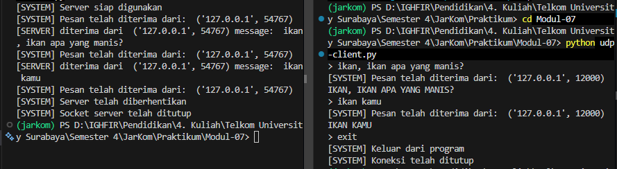

# Modul 7 Socket Programming - UDP 
### Implementasi Komunikasi Client-Server Menggunakan Protokol Connectionless

Nama    : Ighfir Maulana  
NIM     : 103072400029  
Kelas   : IF-04-04

---

## 📋 Daftar Isi
- [Implementasi Kode](#-implementasi-kode)
- [Langkah Eksekusi](#-langkah-eksekusi)
- [Hasil Analisis](#-hasil-analisis)

---

## 💻 Implementasi Kode

### 1. UDP Server (`udp-server.py`)
Server bertugas untuk mendengarkan (*listen*) pada port tertentu dan mengubah pesan yang diterima menjadi huruf kapital sebelum mengirimkannya kembali.

```python
from socket import *

# Inisialisasi port dan socket
serverPort = 12000
serverSocket = socket(AF_INET, SOCK_DGRAM)

# Bind socket ke alamat IP dan port
serverSocket.bind(("", serverPort))

print("[SYSTEM] Server siap digunakan pada port", serverPort)

running = True
while running:
    # Menerima data dari klien
    message, clientAddress = serverSocket.recvfrom(2048)
    decodedMessage = message.decode()
    
    print(f"[SYSTEM] Pesan diterima dari {clientAddress}: {decodedMessage}")
    
    if decodedMessage.lower() == "exit":
        print("[SYSTEM] Server telah diberhentikan")
        running = False
        continue
    
    # Memproses pesan (Convert to Uppercase)
    modifiedMessage = decodedMessage.upper()
    
    # Mengirim kembali ke klien
    serverSocket.sendto(modifiedMessage.encode(), clientAddress)

serverSocket.close()
```

### 2. UDP Client (udp-client.py)
Klien mengirim pesan yang diinput oleh pengguna ke server dan menunggu balasan.

```python
from socket import *

serverName = "localhost"
serverPort = 12000

# Membuat socket UDP
clientSocket = socket(AF_INET, SOCK_DGRAM)

print("[SYSTEM] UDP Client Aktif. Ketik 'exit' untuk keluar.")

running = True
while running:
    message = input("> ")
    
    # Kirim pesan ke server
    clientSocket.sendto(message.encode(), (serverName, serverPort))
    
    if message.lower() == "exit":
        print("[SYSTEM] Keluar dari program")
        running = False
        continue
    
    # Menerima balasan dari server (Corrected logic)
    modifiedMessage, serverAddress = clientSocket.recvfrom(2048)
    
    print(f"[SERVER {serverAddress}]: {modifiedMessage.decode()}")

clientSocket.close()
print("[SYSTEM] Koneksi ditutup")
```

---

## 🚀 Langkah Eksekusi
Untuk menjalankan simulasi ini, diperlukan dua jendela terminal terpisah:

1. Split terminal dengan `Ctrl` + `Shift` + `5`

2. Jalankan Server:
```Bash
python udp-server.py
```

3. Jalankan Klien:
```Bash
python udp-client.py
```

4. Masukkan teks di terminal klien. Server akan menerima, mencetak log, dan mengirimkan versi huruf kapital kembali ke klien.


---

## 📝 Hasil Analisis
Mekanisme Socket UDP
Pada kode di atas, beberapa fungsi kunci yang digunakan adalah:
1. `socket(AF_INET, SOCK_DGRAM)`. `AF_INET` menunjukkan penggunaan alamat IPv4, dan SOCK_DGRAM menentukan bahwa kita menggunakan UDP (Datagram).

2. `bind()`. Digunakan oleh server untuk "mengunci" aplikasi pada port 12000 agar sistem operasi tahu ke mana harus mengarahkan paket UDP yang masuk.

3. `recvfrom(2048)`. Karena UDP tidak memiliki koneksi tetap, fungsi ini sangat penting karena ia tidak hanya menerima data, tetapi juga variabel `clientAddress` (IP dan Port pengirim) agar server tahu ke mana harus membalas.

---

## 🤝 Kontribusi
Laporan ini disusun sebagai bagian dari tugas praktikum S-1 Informatika Telkom University. Kalau kamu ingin memberikan saran atau perbaikan pada dokumentasi ini, silakan ikuti langkah berikut:
1.  Lakukan **Fork** pada repositori ini.
2.  Buat branch baru untuk fitur atau perbaikan Anda.
3.  Kirimkan **Pull Request** dengan penjelasan mengenai perubahan yang dilakukan.

---
**Informatics Lab - Telkom University** *Tahun Ajaran 2025/2026*