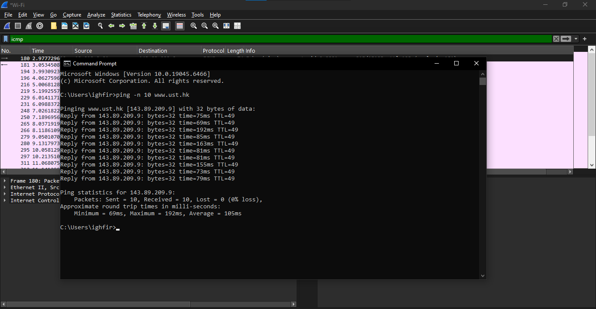
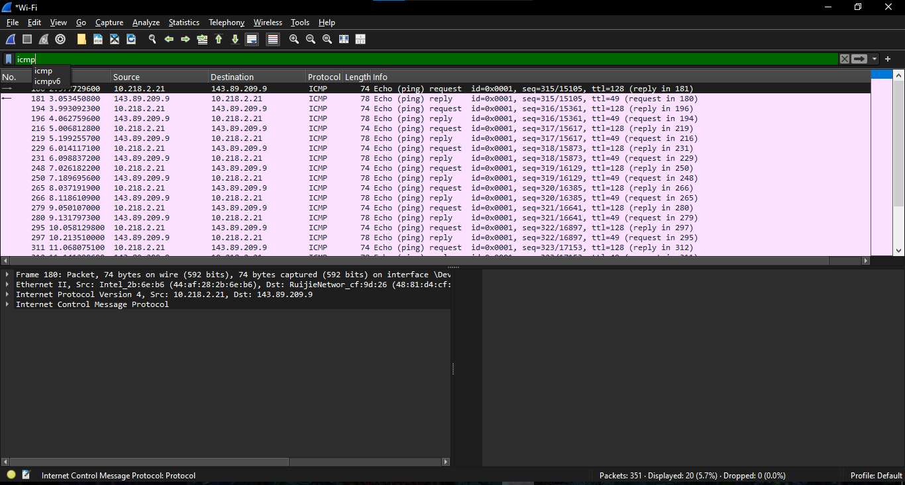
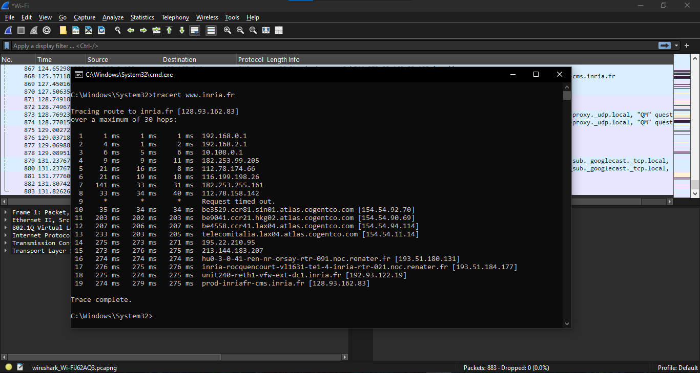
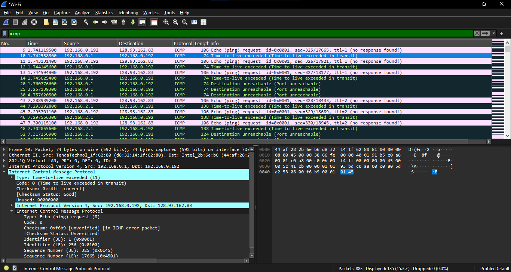

# Modul 12 ICMP (*Internet Control Message Protocol*)
### Analisis Perilaku Pesan Kendali Jaringan dan Mekanisme Diagnostik Utilitas Jaringan

Nama    : Ighfir Maulana  
NIM     : 103072400029  
Kelas   : IF-04-04

---

## 📋 Daftar Isi
- [Dasar Teori ICMP](#-dasar-teori-icmp)
- [Eksperimen 1: Analisis Paket ICMP Ping](#-eksperimen-1-analisis-paket-icmp-ping)
- [Eksperimen 2: Analisis Paket ICMP Traceroute](#-eksperimen-2-analisis-paket-icmp-traceroute)

---

## 📖 Dasar Teori ICMP
ICMP digunakan oleh host dan router untuk saling berkomunikasi di level network layer, utamanya untuk pelaporan kesalahan (*error reporting*) atau kueri diagnostik. ICMP dibungkus langsung di dalam datagram IP (Protocol field = 1). 

Struktur dasar header ICMP terdiri dari 3 field utama yang selalu ada di setiap tipe paket:
* **Type (8-bit)** menentukan kategori makro dari pesan ICMP.
* **Code (8-bit)** memberikan deskripsi spesifik/sub-kategori dari parameter *Type*.
* **Checksum (16-bit)** memastikan integritas data pesan ICMP dari kerusakan bit transmisi.

---

## 🚀 Eksperimen 1: Analisis Paket ICMP Ping

Skenario dijalankan dengan mengeksekusi perintah `ping -n 10 www.ust.hk` pada terminal Windows, yang memicu pertukaran pesan kueri dua arah secara berurutan.

### 1. Alur Transmisi Paket
Berdasarkan hasil *capture*, proses pengujian konektivitas ke `www.ust.hk` (`143.89.209.9`) dari alamat IP lokal host (`10.218.2.21`) memicu pertukaran pesan kueri ICMP berpasangan secara sekuensial.

### 2. Bedah Struktur Data Header ICMP (Wireshark)

#### **A. Paket ICMP Echo Request (Outbound)**
Paket yang dikirimkan oleh komputer klien menuju server target:
* **Type:** `8` (Echo / Ping request)
* **Code:** `0`
* **Checksum:** `0x4c20` (Valid)
* **Identifier (BE):** `1` (`0x0001`)
* **Identifier (LE):** `256` (`0x0100`)
* **Sequence Number (BE):** `315` (`0x013b`)
* **Sequence Number (LE):** `15105` (`0x3b01`)
* **Payload Data:** Berisi beban data standar sebesar 32 byte.

#### **B. Paket ICMP Echo Reply (Inbound)**
Paket respon balik yang dikirimkan oleh server `143.89.209.9` ke komputer klien:
* **Type:** `0` (Echo / Ping reply)
* **Code:** `0`
* **Checksum:** `0x5420` (Valid)
* **Identifier (BE):** `1` (`0x0001`)  — *sama dengan paket request*
* **Identifier (LE):** `256` (`0x0100`)  — *sama dengan paket request*
* **Sequence Number (BE):** `315` (`0x013b`)  — *sama dengan paket request*
* **Sequence Number (LE):** `15105` (`0x3b01`)  — *sama dengan paket request*
* **Payload Data:** Berisi beban data standar sebesar 32 byte.  — *sama dengan paket request*

> **Analisis:** Kesamaan nilai *Identifier* dan *Sequence Number* pada paket Reply merupakan mekanisme krusial bagi sistem operasi pengirim untuk mencocokkan respon yang datang dengan permintaan yang dikirimkan, sehingga nilai *Round-Trip Time* (RTT) dapat dihitung dengan presisi.

---

## 🗺️ Eksperimen 2: Analisis Paket ICMP Traceroute

Skenario kedua dilakukan dengan mengeksekusi perintah `tracert www.inria.fr`. Ini bekerja dengan memanfaatkan manipulasi nilai TTL (*Time to Live*) pada header IP secara inkremental (dimulai dari TTL = 1).

### 1. Hasil Eksekusi Utilitas `tracert` pada Terminal

Setelah masuk ke `C:\Windows\System32` dan mnggunakan command prompt atau PowerShell, hasil log konsol PowerShell menunjukkan proses pelacakan berhasil mengidentifikasi rute hop awal dengan informasi latensi sebagai berikut:
* **Hop 1:** Menuju default gateway jaringan lokal kampus di IP **10.252.241.1** dengan catatan waktu respons super cepat: `1 ms`, `1 ms`, `1 ms`. Ini menunjukkan efisiensi tinggi pada segmen interkoneksi lokal (LAN).
* **Hop berikutnya:** Paket diteruskan keluar dari infrastruktur lokal menuju jaringan penyedia layanan internet (ISP) publik sebelum diarahkan ke rute transnasional.

### 2. Analisis Paket pada Wireshark (Mekanisme TTL & Pesan Kesalahan)
Melalui analisis *packet-trace* yang ditangkap bersamaan di Wireshark, ditemukan bukti bagaimana sistem operasi berbasis Windows menjalankan fungsi `tracert`:

#### **A. Paket Request dari Klien (`192.168.0.192`)**
* Berbeda dengan sistem operasi Unix/Linux yang menggunakan probe UDP port tinggi, utilitas `tracert` pada Windows terbukti menggunakan paket **ICMP Echo Request**.
* **Type:** `8` | **Code:** `0`
* **Manipulasi TTL:** Paket pertama dikirimkan dengan properti lapisan IP berupa parameter **TTL (Time to Live) = 1**. Paket berikutnya dinaikkan menjadi TTL = 2, TTL = 3, dan seterusnya secara inkremental.

#### **B. Paket Respons dari Router Perantara**
* Ketika paket dengan TTL = 1 sampai di router lompatan pertama, nilai TTL tersebut dikurangi 1 oleh prosesor router sehingga menjadi **0**.
* Karena TTL bernilai 0, router mendrop paket tersebut dan mengirimkan sinyal umpan balik berupa pesan kesalahan (*Error Message*) kembali ke host praktikan.
* **Type:** `11` (Time-to-live exceeded)
* **Code:** `0` (Time to live exceeded in transit)
* **Checksum:** `0xf4ff` (Status: Good/Valid)
* **Payload Penyerta:** Di dalam paket Type 11 ini, router menyertakan kembali salinan (*copy*) dari header IP asal beserta data payload asli yang dibuangnya. Hal ini bertujuan agar stack protokol komputer klien dapat mengidentifikasi secara spesifik paket request mana yang memicu terjadinya *error drop* di router tersebut.

## 🤝 Kontribusi
Laporan ini disusun sebagai bagian dari tugas praktikum S-1 Informatika Telkom University. Kalau kamu ingin memberikan saran atau perbaikan pada dokumentasi ini, silakan ikuti langkah berikut:
1.  Lakukan **Fork** pada repositori ini.
2.  Buat branch baru untuk fitur atau perbaikan Anda.
3.  Kirimkan **Pull Request** dengan penjelasan mengenai perubahan yang dilakukan.

---
**Informatics Lab - Telkom University**
*Copyright © 2026 - UKM Coder*